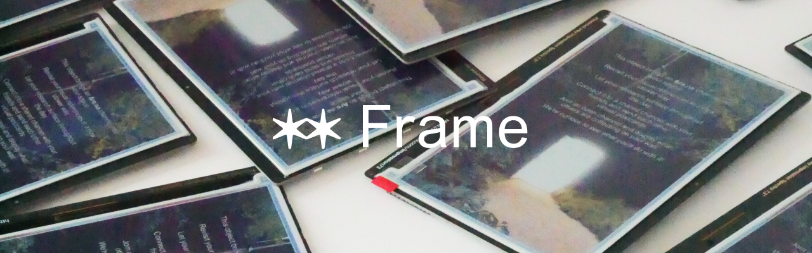
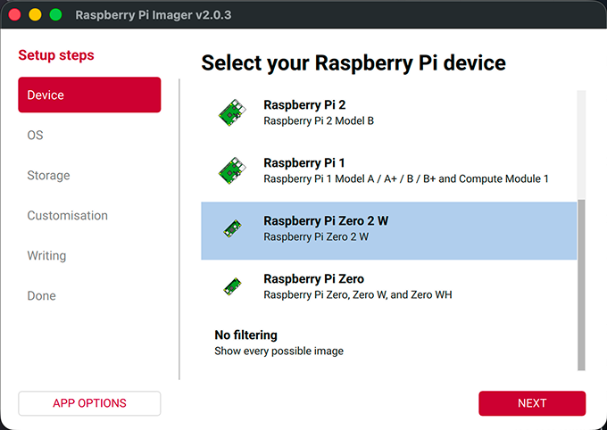
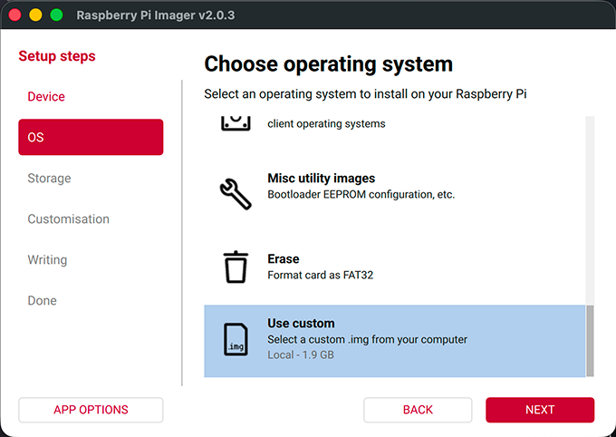
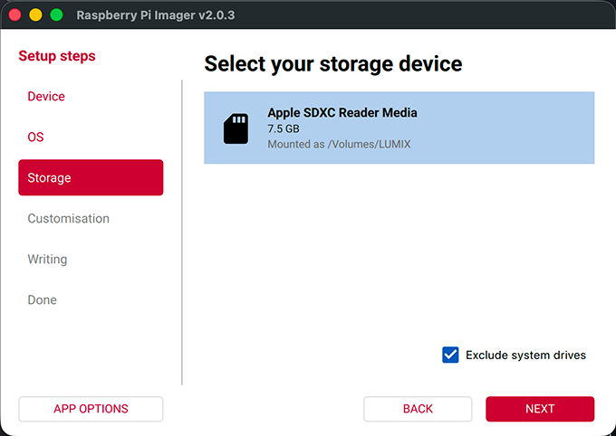
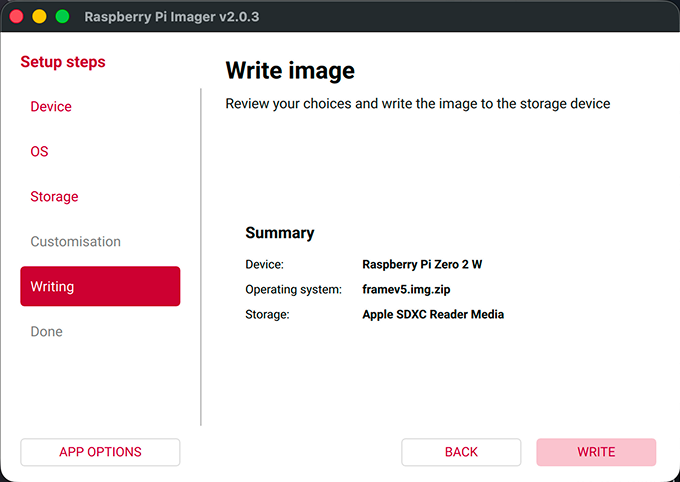
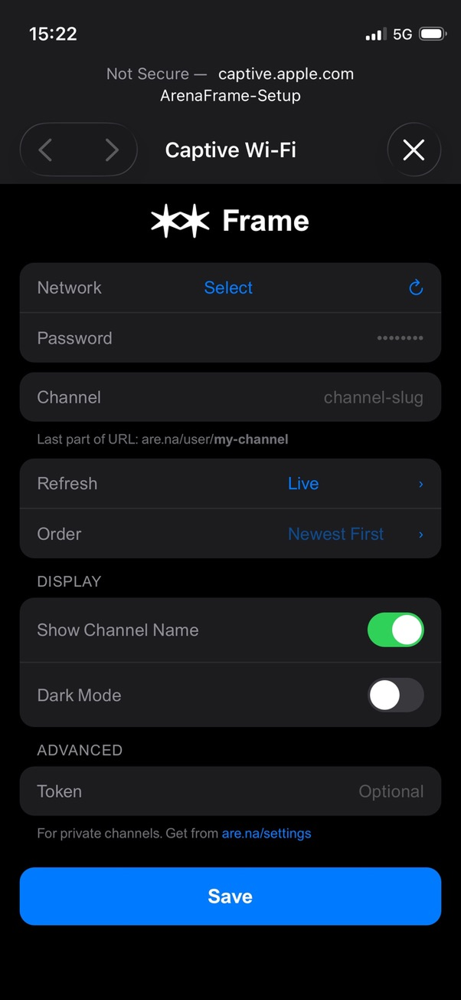

# Arena Frame
<a href="./images/BANNER.png"></a>

Bring an Are.na channel into your space

Arena Frame is an open-source object that connects to [Are.na](https://are.na) and displays a channel's content on a colour e-ink screen. Choose between cycling through blocks or displaying new ones live as they come in.

Revisit your visual references in a slower way, let your research surface throughout the day.
Connect a shared channel with friends and send each other virtual postcards. We're curious to see what you do with it!

## Build your Frame

### Shopping list
To build a frame, you'll need the following components

| Item | URL |
| - | - |
| Raspberry Pi Zero 2 W (with presoldered header pins) | [UK](https://shop.pimoroni.com/products/raspberry-pi-zero-2-w?variant=42101934587987) [US](https://www.pishop.us/product/raspberry-pi-zero-2w-with-headers/) |
| Inky Impression display (available in 4", 7.3" and 13.3" flavours | [UK](https://shop.pimoroni.com/products/inky-impression?variant=55186435244411) [US](https://www.pishop.us/product/inky-impression-7-3-2025-edition/) |
| MicroSD card (16GB or larger) | [UK](https://thepihut.com/products/sandisk-microsd-card-class-10-a1) [US](https://www.pishop.us/product/class-10-microsd-card-32-gb-blank-retail/) |
| 5V DC Micro USB power source (You might already have the bits for this around!) | [UK](https://shop.pimoroni.com/products/raspberry-pi-12-5w-micro-usb-power-supply?variant=39493050237011) [US](https://www.pishop.us/product/wall-adapter-power-supply-micro-usb-2-4a-5-25v) |

---

### Setting up the software
The easiest way to do this is to flash the premade image onto your SD card.

### Step 1: Download the Image

1. Go to [Releases](https://github.com/k-sdm/arena-frame/releases)
2. Download `arenaframe.img.zip` (you don't need to unzip it)

### Step 2: Install Raspberry Pi Imager

1. Go to [raspberrypi.com/software](https://www.raspberrypi.com/software/)
2. Download Raspberry Pi Imager for your computer (Mac, Windows, or Linux)
3. Install and open it

### Step 3: Flash the Image

1. Insert your MicroSD card into your computer
2. In Raspberry Pi Imager, click **Choose Device** → select **Raspberry Pi Zero 2 W**
3. Click **Choose OS** → scroll to the bottom → click **Use custom**
4. Select the `arenaframe.img.zip` file you downloaded
5. Click **Choose Storage** → select your MicroSD card
6. Click **Next** and start writing
7. Wait for it to complete, then remove the SD card

<details>
   <summary>See step-by-step images 🖼️</summary>

   |<a href="./images/PI_IMAGER_1.png"></a>|<a href="./images/PI_IMAGER_2.png"></a>|
   |--|--|
   |<a href="./images/PI_IMAGER_3.png"></a>|<a href="./images/PI_IMAGER_4.png"></a>|
</details>

### Step 4: Assemble and Power On

1. Insert the MicroSD card into your Raspberry Pi
2. Connect the Inky Impression display to the GPIO pins
3. Connect power via either micro USB port
4. Wait about 60 seconds — the white LED on the display will start blinking

### Step 5: Connect and Configure

1. On your phone or laptop, open WiFi settings
2. Connect to the network **ArenaFrame-Setup** (password: `arenaframe`)
3. A configuration page should open automatically. If it doesn't, try opening a browser


<details>
   <summary>See the setup portal 🖼️</summary>

   <a href="./images/portal.png"></a>
</details>

4. **Network** — Select your home WiFi network from the dropdown and enter its password. If your network doesn't appear in the list, select **Other** and type the name in manually
5. **Channel** — Enter your Are.na channel slug, the last part of the channel URL
   - Example: if your channel is `are.na/username/my-inspiration`, enter `my-inspiration`
6. **Refresh & Order** — Choose how the frame cycles through content

   | Refresh | Description |
   |---------|-------------|
   | Live | Displays new blocks as they arrive |
   | 5 min – 24 hr | Cycles through existing blocks at the chosen interval |


7. **Display** — Toggle **Show Channel Name** to overlay the block title and channel info on the display, and **Dark Mode** for a dark background on text blocks
8. **Advanced** — Optionally enter your [personal access token](https://www.are.na/settings/personal-access-tokens) if you're connecting to a private channel
9. Tap **Save**
10. Your first block should appear within a minute!

---

## Re-entering Setup Mode

If you need to change WiFi or channel settings:

- **Hold Button A for 3 seconds** (the top button on the display)
- The LED will start blinking and the ArenaFrame-Setup network will reappear

The frame also enters setup mode automatically if it can't connect to WiFi or if the channel slug is incorrect.

---

## Hacking / Modding

Arena Frame is designed to be modified. SSH is enabled by default.

### Connect via SSH

Make sure your computer is on the same WiFi network as the frame.

```bash
ssh pi@frame.local
```

Password: `arenaframe`

If `frame.local` doesn't resolve, find the IP address from your router and use that instead.

### Project Structure

```
~/arena-frame/
├── main.py              # Entry point
├── config.py            # Configuration management
├── sources/             # Content sources (Are.na API)
├── display/             # E-ink rendering
├── portal/              # WiFi setup web portal
├── hardware/            # Buttons and LED
└── wifi/                # WiFi management
```

### Useful Commands

```bash
# View live logs
sudo journalctl -u arena-frame -f

# Restart the display service
sudo systemctl restart arena-frame

# Stop all services
sudo systemctl stop arena-frame arena-buttons wifi-manager

# Update to latest version
cd ~/arena-frame && git pull
sudo systemctl restart arena-frame
```

### Working with AI Coding Agents

The repo includes an [`AGENT CONTEXT.md`](./AGENT%20CONTEXT.md) file that gives AI coding agents (Cursor, Copilot, Claude Code, etc.) the full picture of the project — architecture decisions, service layout, pin constraints, and extension points. Open or reference this file when starting an agent session to get useful, project-aware suggestions out of the box.

### Configuration File

Settings are stored at `/etc/photoframe/config.json`:

```json
{
  "channel_slug": "your-channel",
  "refresh": "live",
  "order": "newest",
  "show_info": true,
  "dark_mode": false
}
```

---

## Alternative: Install Script

If you already have a Raspberry Pi running Raspberry Pi OS, you can install Arena Frame using the install script.

### Requirements

- Raspberry Pi with Raspberry Pi OS (Bookworm or later)
- Pimoroni Inky Impression connected

### Installation

```bash
git clone https://github.com/ks-dm/arena-frame.git
cd arena-frame
./install.sh
```

The script will install all dependencies, configure services, and set up the WiFi portal.

When complete:

```bash
sudo reboot
```

Then connect to **ArenaFrame-Setup** to configure.

---

## Troubleshooting

**LED keeps blinking, display doesn't update**
- WiFi credentials may be incorrect
- Channel slug may be wrong
- Reconnect to ArenaFrame-Setup and check your settings

**Can't find ArenaFrame-Setup network**
- Make sure you're close to the frame
- Try power cycling the Pi
- Hold Button A for 3 seconds to force setup mode

**Private channel not working**
- You need an access token for private channels
- Get one at [are.na/settings/personal-access-tokens](https://www.are.na/settings/personal-access-tokens)
- Enter it in the Advanced section of the setup portal

---

## License

MIT — do whatever you want with it.

---

## Credits

A project by kiran Scott de Martinville and [Are.na](https://are.na)
- Display library by [Pimoroni](https://github.com/pimoroni/inky)