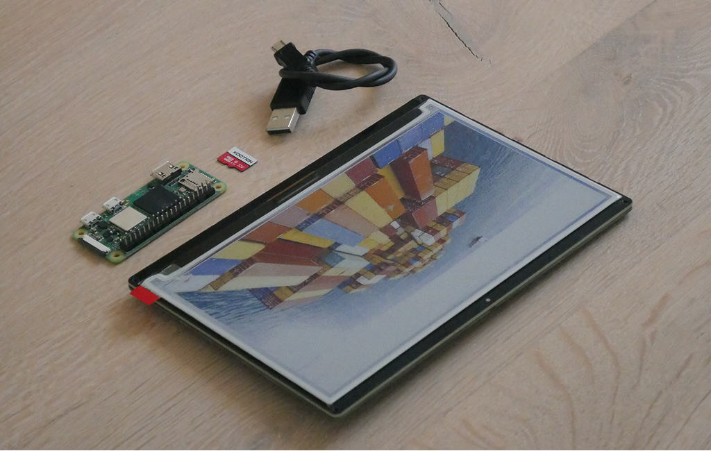
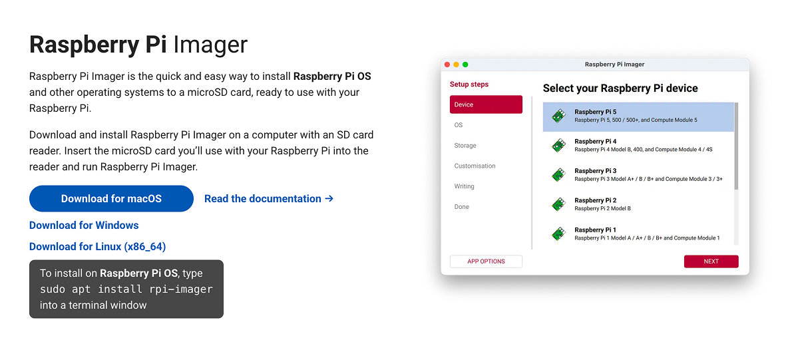
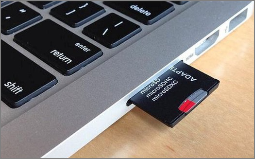
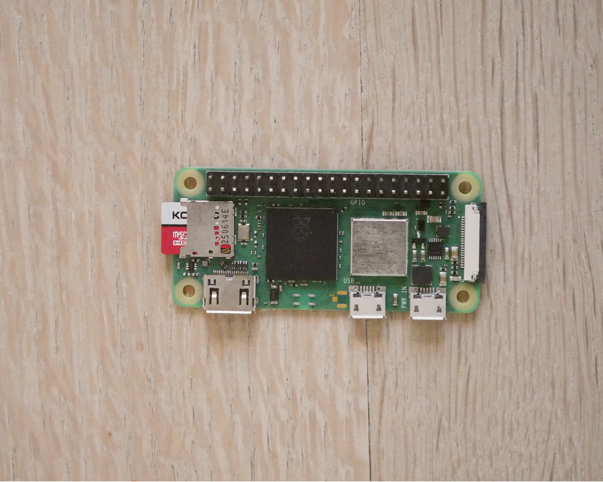
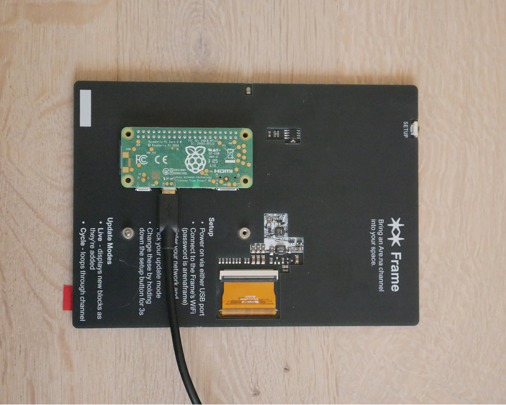
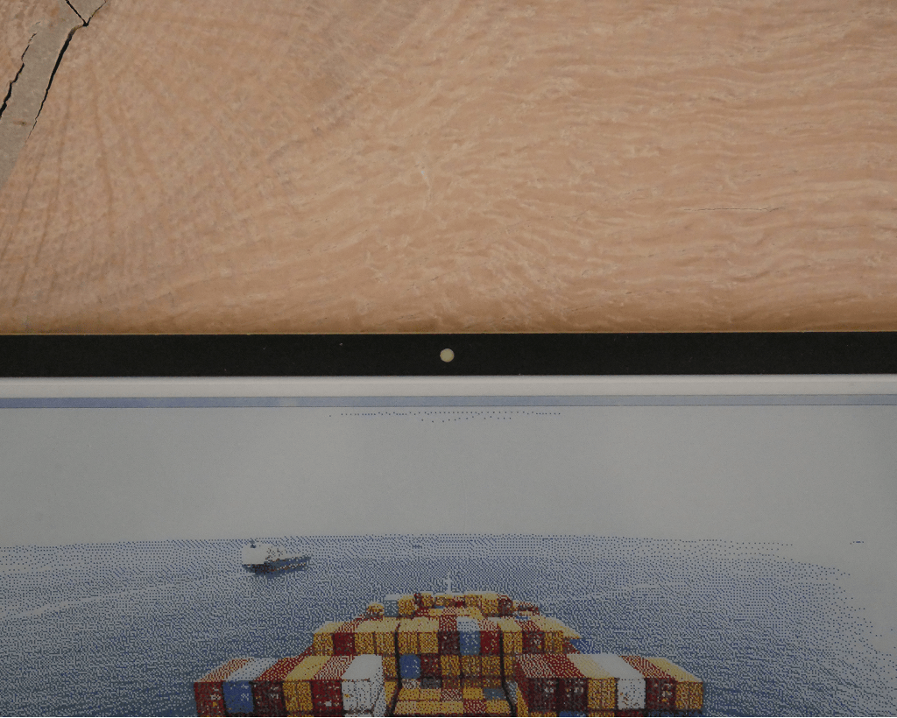
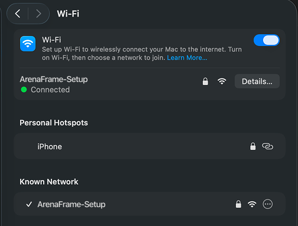

# Arena Frame
<a href="./images/BANNER.png"></a>

Bring an Are.na channel into your space

Arena Frame is an open-source object that connects to [Are.na](https://are.na) and displays a channel's content on a colour e-ink screen. Choose between cycling through blocks or displaying new ones live as they come in.

Revisit your visual references in a slower way, let your research surface throughout the day.
Connect a shared channel with friends and send each other virtual postcards. We're curious to see what you do with it!

## Building your frame

### Shopping list
To build a frame, you'll need the following components

| Item | URL |
| - | - |
| Raspberry Pi Zero 2 W (with presoldered header pins) | [UK](https://shop.pimoroni.com/products/raspberry-pi-zero-2-w?variant=42101934587987) [US](https://www.pishop.us/product/raspberry-pi-zero-2w-with-headers/) |
| Inky Impression display (available in 4", 7.3" and 13.3" flavours) | [UK](https://shop.pimoroni.com/products/inky-impression?variant=55186435244411) [US](https://www.pishop.us/product/inky-impression-7-3-2025-edition/) |
| MicroSD card (16GB or larger) | [UK](https://thepihut.com/products/sandisk-microsd-card-class-10-a1) [US](https://www.pishop.us/product/class-10-microsd-card-32-gb-blank-retail/) |
| 5V DC Micro USB power source | [UK](https://shop.pimoroni.com/products/raspberry-pi-12-5w-micro-usb-power-supply?variant=39493050237011) [US](https://www.pishop.us/product/wall-adapter-power-supply-micro-usb-2-4a-5-25v) |

<a href="./images/components.png"></a>

---

### Copying the code onto the memory card

#### Step 1
Click [here](https://github.com/k-sdm/arena-frame/releases/download/v1.2.2/arenaframe.img.zip) to download the latest version of the frame's software.

#### Step 2
Next, you need a free program called **Raspberry Pi Imager**. This is the tool that puts the software onto the memory card. Go to [raspberrypi.com/software](https://www.raspberrypi.com/software/), download it for your computer, and install it like any other app.

<a href="./images/imager-download.png"></a>

#### Step 3
Put the memory card into your computer. Depending on your laptop you may need a small adapter (sometimes called an SD card reader).

<a href="./images/microsd-in-laptop.png"></a>

#### Step 4
Open Raspberry Pi Imager. Click the **Choose Device** button and pick **Raspberry Pi Zero 2 W** from the list.

<a href="./images/PI_IMAGER_1.png"></a>

#### Step 5
Click **Choose OS**. Scroll all the way to the bottom of the list and click **Use custom**. A file browser will open — find the `arenaframe.img.zip` file you downloaded in Step 1 and select it.

<a href="./images/PI_IMAGER_2.png"></a>

#### Step 6
Click **Choose Storage** and pick your memory card from the list. Then click **Next** and let it do its thing — this takes a few minutes. When it's finished, you can take the memory card out of your computer.

<p>
  <a href="./images/PI_IMAGER_3.png"></a>
  <a href="./images/PI_IMAGER_4.png"></a>
</p>

### Assembling your frame

#### Step 7
Take the memory card out of your computer and slide it into the small slot on the side of the Raspberry Pi. It only fits one way, so don't force it.

<a href="./images/pi.png"></a>

#### Step 8
Now connect the Raspberry Pi to the back of the Inky Impression display. The Pi has two rows of small metal pins called the header - these go into a matching set of holes on the display. Line them up and gently press the Pi down onto the pins until it sits flat against the display. Double-check the orientation is the same as the image before pressing.

<a href="./images/assembly.png"></a>

#### Step 9
Plug a 5V Micro USB power supply into either of the two ports on the Raspberry Pi. After about a minute, the small white light on the display will start blinking — that means your frame is ready to be set up.

<a href="./images/blink.gif"></a>

<details>
   <summary>Troubleshooting: the white light doesn't turn on</summary>

- First, check the small green light on the Raspberry Pi itself. If it's flickering, the Pi is powered on and reading the memory card — just give it another minute or two to finish starting up.
- If the green light isn't flickering (or isn't on at all), the Pi either hasn't powered on or can't read the memory card. Try these, in order:
  - Reflash the memory card by following Steps 1–6 again.
  - Make sure you're using a good-quality MicroSD card. Cheap or very old cards often fail to boot.
  - Make sure your power supply is rated for the Raspberry Pi Zero 2 W. Phone chargers and random USB cables often don't deliver enough power — use the one linked in the shopping list above if in doubt.
</details>

### Configuring your frame

#### Step 10
Grab your phone or laptop and open its WiFi settings. Look for a network called **ArenaFrame-Setup** and connect to it using the password `arenaframe`. This is a temporary WiFi network the frame creates so you can talk to it — you can connect to it any time the white light on the display is flashing.

<a href="./images/wifi.png"></a>

#### Step 11
Once you're connected, a setup page should pop up on its own. If it doesn't, open any web browser while still connected to **ArenaFrame-Setup** and the page will load. This is where you'll fill in the settings for your frame.

<a href="./images/portal.png"></a>

#### Step 12
Under **Network**, pick your home WiFi from the drop-down list and type its password underneath. If you don't see your network in the list, select **Other** and type the name in manually — make sure you spell it exactly right.

#### Step 13
Under **Channel**, type in the slug of the Are.na channel you want to display. The slug is just the last part of the channel's web address. For example, if your channel lives at `are.na/username/my-inspiration`, the slug is `my-inspiration`.

#### Step 14
Under **Refresh & Order**, choose how the frame cycles through the blocks in your channel:

- **Live** — shows new blocks the moment they're added to the channel.
- **5 min, 15 min, 30 min, 1 hour, 12 hour, 24 hour** — shows a different block at the interval you pick.

For the time-based options, you can also choose whether the frame cycles **newest first**, **oldest first**, or **at random**.

Under **Display**, you can turn on **Dark Mode** and choose whether the channel name is shown at the bottom of the frame.

Under **Advanced**, if your channel is private, paste in a [personal access token](https://www.are.na/settings/personal-access-tokens) so the frame can see it. You can skip this for public channels.

#### Step 15
Tap **Save**. Your first block should appear on the frame within a minute.

<a href="./images/updating.gif"></a>

<details>
   <summary>Troubleshooting: connecting and saving</summary>

- **I can't connect to ArenaFrame-Setup.** This sometimes takes a couple of tries. Try turning your phone or laptop's WiFi off and on again, tell your device to "forget" the ArenaFrame-Setup network and try again, or unplug the frame, wait a few seconds, and plug it back in.
- **The configuration portal keeps closing** This can sometimes happen before you finish copying in all your information, you can press save along the way then hold BUtton A to continue entering info.
- **The white light keeps flashing after I pressed Save.** That means the frame hit an error — either it couldn't connect to your home WiFi, or it couldn't find your Are.na channel. Reconnect to ArenaFrame-Setup and carefully check the spelling of your WiFi name, WiFi password, and channel slug. These are all case-sensitive, so `My-Channel` and `my-channel` are not the same!
</details>

---

## Changing the settings later

If you ever want to change your WiFi, channel, or display settings, **hold Button A** (the top button on the back of the display) **for 3 seconds**. The white light will start flashing again and the **ArenaFrame-Setup** network will reappear — connect to it just like you did the first time and update whatever you need.

---

## Make it your own

Arena Frame is designed to be modified, hacked and built on. The whole thing is a small Python project running on the Pi, and SSH is enabled by default so you can log in and tinker.

### Logging in

#### Connecting to the frame via SSH

Make sure your computer is on the same WiFi network as the frame, then from a terminal run:

```bash
ssh pi@frame.local
```

Password: `arenaframe`

If `frame.local` doesn't resolve, find the Pi's IP address from your router's admin page (or with a tool like `nmap`) and use that instead:

```bash
ssh pi@192.168.1.42
```

#### Working with AI coding agents

Modifying code over SSH in `vim` or `nano` works but isn't much fun. The easiest way to hack on the frame is to use an AI coding agent (Cursor, Claude Code, Copilot, etc.) locally on your computer, and sync changes to the Pi.

The repo includes an [`AGENT CONTEXT.md`](./AGENT%20CONTEXT.md) file that gives agents the full picture of the project — architecture decisions, service layout, pin constraints, and extension points. Point your agent at it when starting a session to get project-aware suggestions straight away.

A reasonable workflow looks like this:

1. Clone the repo to your computer and open it in your editor of choice.
2. Make changes locally with your agent's help.
3. Push changes to the Pi with the included sync script:

   ```bash
   ./sync-to-pi.sh                 # defaults to pi@frame.local
   ./sync-to-pi.sh pi@192.168.1.42 # or pass a specific host
   ```

   This rsyncs your local changes to `~/arena-frame/` on the Pi, copies any system config files, and restarts the relevant services.
4. Check that everything is running correctly by tailing the logs over SSH (see below).

### Anatomy of the frame

#### Project layout

```
~/arena-frame/
├── main.py                 # Entry point — scheduler loop
├── config.py               # Unified config/state/error management
├── sources/                # Content sources (Are.na API, local folder stub)
├── display/                # E-ink rendering, dithering, text
├── portal/                 # Flask WiFi setup web portal
├── hardware/               # GPIO buttons and LED
├── wifi/                   # WiFi state machine and utilities
├── utils/                  # Shared helpers
├── system/config/          # hostapd + dnsmasq config templates
└── content/                # Downloaded images (temporary)
```

#### Services

Each part of Arena Frame runs as its own `systemd` service, so they start on boot and restart automatically if they crash:

| Service | What it does |
|---|---|
| `arena-frame.service` | Main loop — fetches blocks and updates the display |
| `arena-buttons.service` | Watches Button A for the "enter setup mode" hold |
| `arena-led.service` | Blinks the white LED when setup mode is active |
| `wifi-manager.service` | Switches between client WiFi and AP setup mode |
| `wifi-portal-web.service` | Serves the setup page at `192.168.4.1` in AP mode |

#### Configuration file

Your settings from the setup portal are stored as JSON at `/etc/photoframe/config.json`:

```json
{
  "channel_slug": "your-channel",
  "arena_token": null,
  "refresh": "live",
  "order": "newest",
  "show_info": true,
  "dark_mode": false
}
```

You can edit this file directly over SSH if you prefer, then restart `arena-frame` to pick up the changes. Re-entering the setup portal (hold Button A for 3 seconds) will overwrite whatever is here.

### Hacking on it

#### Useful commands

Run these over SSH on the Pi.

```bash
# Tail logs (swap in any service name)
sudo journalctl -u arena-frame -f
sudo journalctl -u wifi-manager -f

# Restart a single service after a code change
sudo systemctl restart arena-frame

# Restart everything
sudo systemctl restart arena-frame arena-buttons arena-led wifi-manager wifi-portal-web

# Check service status
systemctl status arena-frame

# Pull the latest code from GitHub
cd ~/arena-frame && git pull
sudo systemctl restart arena-frame

# Manually test the display with an image
~/.virtualenvs/pimoroni/bin/python -m display.renderer ~/test.jpg
```

#### Extending the frame

Good places to start if you want to add something new:

- **New content sources** — Subclass `ContentSource` in `sources/__init__.py` to pull blocks from somewhere other than Are.na (RSS, a local folder, another API).
- **Custom dithering** — Drop a new algorithm into `display/dither.py` alongside the default PIL one.
- **Display overlays** — Tweak `display/renderer.py` to change how channel info, errors, or block metadata are drawn.
- **New buttons / hardware** — `hardware/buttons.py` uses `gpiozero`. Note that Button A uses GPIO5; avoid GPIO16, which the 13.3" display needs for SPI chip select.

---

## Installing from scratch

If you'd rather not flash the prebuilt image — for example if you already have a Pi running Raspberry Pi OS — you can install Arena Frame with the included script instead.

### Requirements

- Raspberry Pi with Raspberry Pi OS (Bookworm or later)
- Pimoroni Inky Impression connected

### Installation

```bash
git clone https://github.com/ks-dm/arena-frame.git
cd arena-frame
./install.sh
```

The script installs all dependencies, registers the systemd services, and sets up the WiFi portal. When it's done:

```bash
sudo reboot
```

Then connect to **ArenaFrame-Setup** to configure the frame just like you would with a prebuilt image.

---

## License

MIT — do whatever you want with it.

---

## Credits

A project by kiran Scott de Martinville and [Are.na](https://are.na)
- Display library by [Pimoroni](https://github.com/pimoroni/inky)